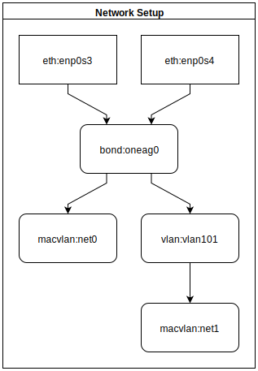

# systemd-network-stack-test

## HowTo Build

You can build this image and do your own tests with https://github.com/systemd/mkosi

Just run `mkosi` in the `root`-directory of this repository.

The image itself is Arch Linux based, so you need `pacman` and `pacstrap`. But you should be able to use any other distribution, as this setup is only configuring systemd. See `mkosi --help` for more information.

## Purpose

This image is a test to setup a little bit more complicated network stack with `systemd-networkd`. It's based upon a real request from [#systemd](irc://freenode.net/systemd).

Here you see the network stack we want to implement. This flowchart helped me very much to understand the relations among all the different parts.
