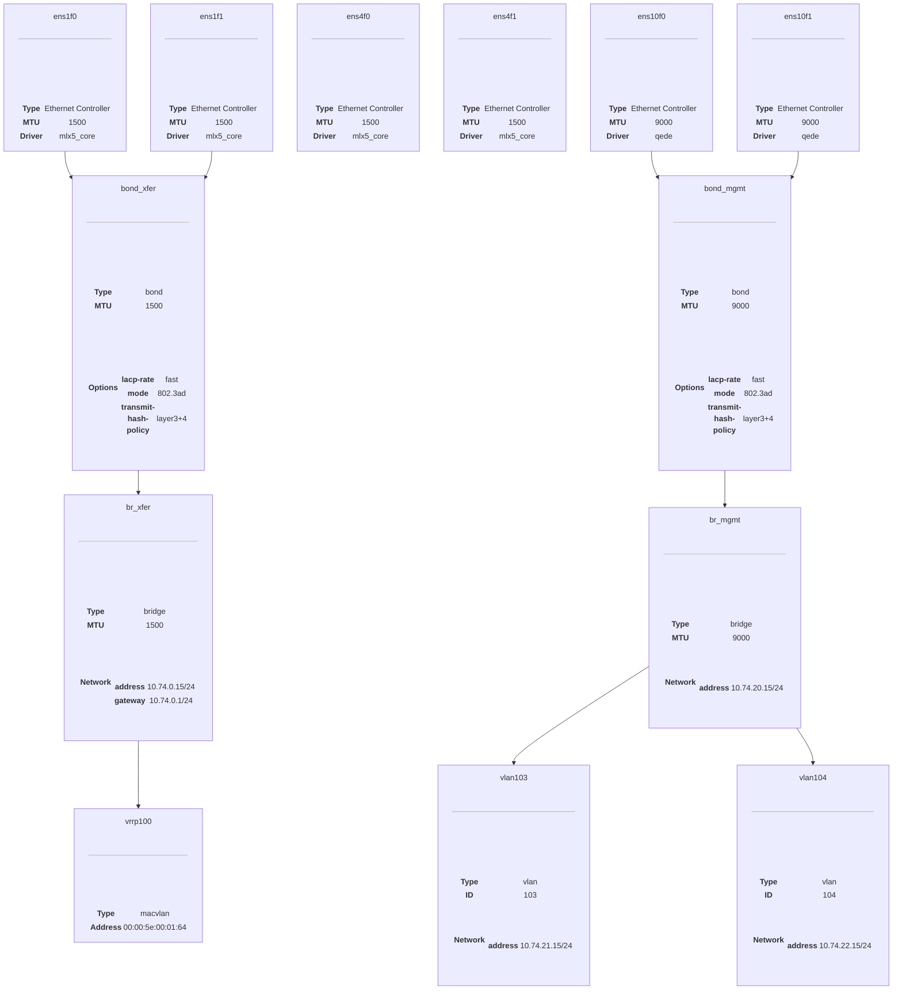

# Navy Lead Fox Terrier

## HowTo Build

You can build this image and do your own tests with https://github.com/systemd/mkosi

Just run `mkosi` in the `root`-directory of this repository.

The image itself is Arch Linux based, so you need `pacman` and `pacstrap`. But you should be able to use any other distribution, as this setup is only configuring systemd. See `mkosi --help` for more information.

## Purpose

Setting up some testing for a colleague of mine, who got this problem at $customer. I try to mimic the hardware as used by the customer to make this actually work, but in the end $colleague has to tell me if this works.

The original setup was done with [Netplan.io](https://netplan.io) with the `networkd` renderer, but I want to reduce the error surface by using `sd-networkd` directly.

